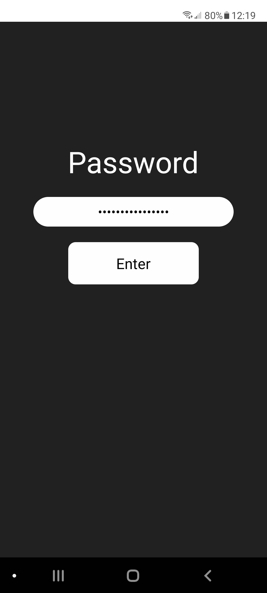
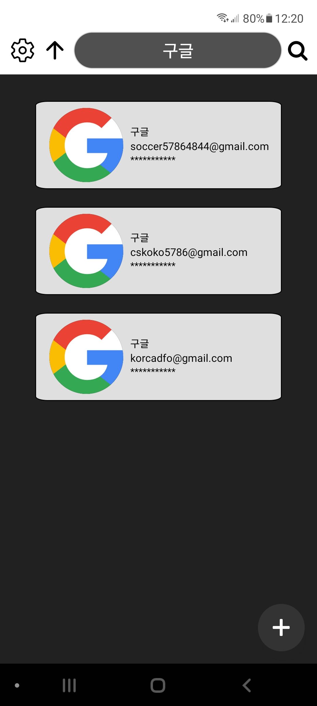
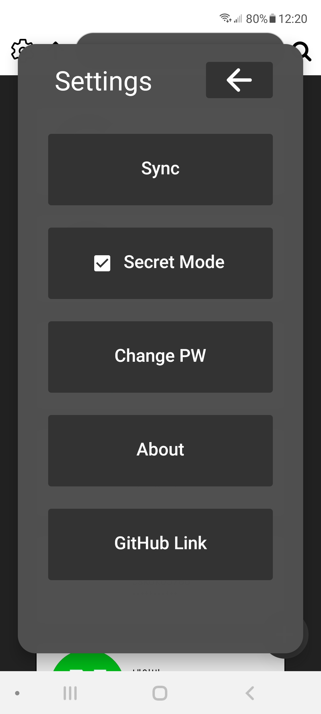
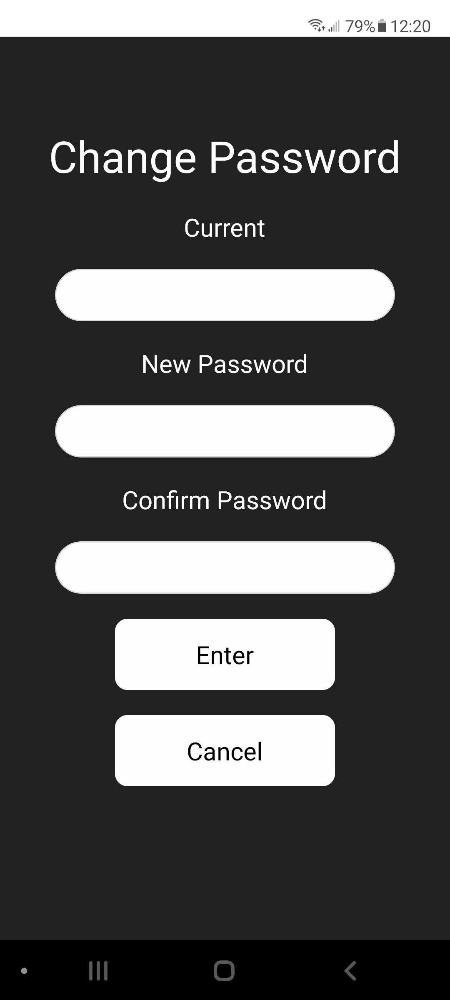

# Account Manager 3

  ## Description

  Account Manager 3 is a comprehensive application designed to manage user accounts in Cloud (AWS DynamoDB). 

  **Developer:** Jun Park

  **Technologies Used:**
  - **Frontend:** React Native Expo
  - **UI:** gluestack-ui (https://gluestack.io/)
  - **Backend:** Django
  - **Local Database:** Sqlite
  - **Cloud Database:** AWS DynamoDB

  ## Screenshots

  |  |  |
  |---------------------------------|-------------------------------|
  |  |  |
  |  | |