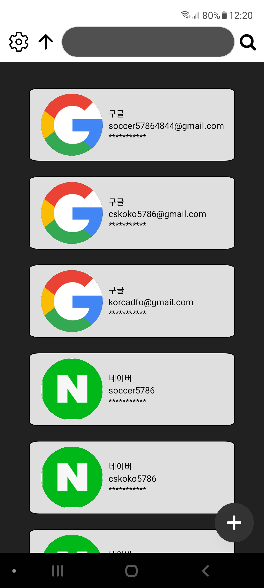

# Account Manager 3

## Description

Account Manager 3 is a comprehensive application designed to manage user accounts in Cloud (AWS DynamoDB). 

**Developer:** Jun Park

**Technologies Used:**
- **Frontend:** React Native Expo
- **UI:** gluestack-ui (https://gluestack.io/)
- **Backend:** Django
- **Local Database:** Sqlite
- **Cloud Database:** AWS DynamoDB

## Screenshots

  
  
  
  
  

